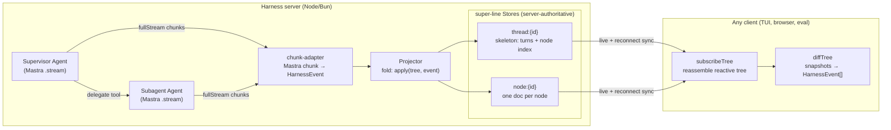
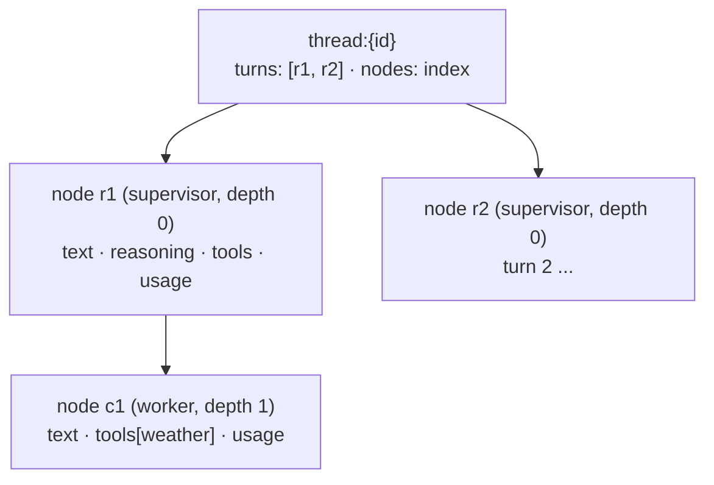

# Super Harness

> The missing piece that makes building and debugging AI applications easy and transparent.

Super Harness is a **generic agent harness** for TypeScript. You bring [Mastra](https://mastra.ai) `Agent`s — your models, memory, and tools — and the harness gives you a supervisor/subagent runtime whose every step is **persisted, streamed, and replayable** in real time. The whole run is a live tree you can subscribe to from a terminal, a browser, or an eval.

It is a thin layer over two foundations: **Mastra `Agent`** is the engine at every node, and a per-node **[super-line](https://super-line.dogar.biz/) Store** is the single transport — the same Store both persists a node's progress and streams it to clients, so persistence, live streaming, and reconnect/late-join are one mechanism instead of three.

The two layers are separate packages: `@super-harness/core` is the **pure engine** — importable in any project, no transport, no super-line — and `@super-harness/server` is the batteries-included super-line binding. Use the engine alone with your own persistence and delegation topology, or the server for the full streaming stack.

## Why

Building on a raw agent SDK, you re-solve the same plumbing every time: how do subagent tool calls get persisted so you can fetch them later; how does a supervisor spawn and track many subagents; how does progress — main *and* nested — stream to a UI without bespoke event wiring per surface. Mastra's `AgentController` bundles an opinionated answer, but it's limiting: coarse `subagent_*` forwarding loses fidelity below the top level, and the transport is baked in.

Super Harness makes three guarantees the design is built around:

1. **Subagent tool calls are persisted** — every call, at every depth, folded into a durable per-node document you can fetch or replay any time.
2. **A supervisor orchestrates many subagents** — arbitrary, depth-gated delegation; each subagent is a first-class node with its own thread.
3. **Everything streams** — main agent *and* every subagent, with full fidelity (reasoning deltas, tool-input deltas, results), over one transport.

## Features

- **Full-fidelity nested streaming.** The same chunk mapper runs at every depth, so a subagent's reasoning and tool-input deltas stream just like the supervisor's — not flattened to `subagent_started`/`subagent_finished`.
- **Store-as-transport.** Each node's progress lives in a super-line Store Resource. That single document is the persistence *and* the live stream *and* the reconnect/late-join snapshot. No separate event log to reconcile with state.
- **Read a session from anywhere.** An isomorphic client view (`subscribeTree` + `diffTree`) reassembles the reactive tree from Store Resources and turns any two snapshots into an incremental `HarnessEvent` stream. The TUI, a browser chat, and an eval all read the same way.
- **Batteries-included built-ins.** `delegate` (spawn a subagent), `ask_user` (root-only human-in-the-loop via tool suspend/resume), and `todo` (a plan surface) come wired.
- **Durable by default.** SQLite-backed Stores out of the box; in-memory for tests.
- **Terminal client included.** An OpenTUI cockpit for developers and a `--headless` stdin/stdout shell for agents — both drive any harness server over super-line.

## Packages

| Package | What it is |
|---|---|
| [`@super-harness/core`](packages/core) | The pure engine: `createController`, the delegation graph (`delegatesTo` edges, depth-gated), the delegate/ask_user/todo built-ins, the chunk-adapter, the projector, and the `TreeSink` persistence port. Depends only on `shared` (+ Mastra as a peer) — no super-line, no transport. |
| [`@super-harness/server`](packages/server) | The batteries-included binding: `createHarness` wires a `Controller` to a super-line server — durable per-node/thread Stores, the wire contract, HITL `suspended` broadcast, and the Store-backed sink. |
| [`@super-harness/shared`](packages/shared) | The isomorphic wire layer: the super-line contract, the `HarnessEvent` union, the tree types + fold (`apply`), and the client-side Store view (`subscribeTree` + `diffTree`). No Mastra, no server deps — safe in the browser, Bun, and Node. |
| [`@super-harness/tui`](packages/tui) | The terminal client — OpenTUI cockpit + headless shell. Runs on Bun. |
| [`examples/dev-server`](examples/dev-server) | A runnable server: a supervisor delegating to a `worker` subagent with a live weather tool. What the quickstart below runs. |

## Quickstart

### Prerequisites

- [pnpm](https://pnpm.io) `11.5+` (the workspace package manager)
- [Bun](https://bun.sh) `1.1+` — the TUI uses `@opentui` (which needs `bun:ffi`); the dev-server also runs under Bun
- An [AI Gateway](https://vercel.com/docs/ai-gateway) API key for the demo's models

```bash
pnpm install
```

### Run the demo

The demo is a two-terminal flow: a harness **server** and the **tui** client that connects to it.

```bash
# 1. put your gateway key in the repo-root .env
cp .env.example .env
$EDITOR .env            # set AI_GATEWAY_API_KEY=...   (optional: CHAT_MODEL=anthropic/claude-haiku-4.5)

# 2. terminal one — start the server (Bun)
pnpm -F @super-harness/dev-server start          # -> ws://localhost:4111/super-line

# 3. terminal two — drive it with the interactive cockpit
pnpm -F @super-harness/tui start -- --url ws://localhost:4111/super-line
```

Type `What's the weather in Istanbul?` — the supervisor delegates to the `worker` subagent, which calls the live weather tool; you watch both lanes stream in real time. Then ask it again in the same session to see the thread accumulate.

For agents (or CI), the same client runs headless over stdin/stdout:

```bash
pnpm -F @super-harness/tui start -- --headless --url ws://localhost:4111/super-line
```

### Use it as a library

`createHarness` (from `@super-harness/server`) takes your Mastra `Agent`s and returns a running super-line server whose Stores stream and persist the tree. You own the agents (models, memory, tools); the harness owns the controller, the contract, the Stores, the built-ins, and the fold.

```ts
import { createServer } from 'node:http'
import { Agent } from '@mastra/core/agent'
import { gateway } from '@ai-sdk/gateway'
import { webSocketServerTransport } from '@super-line/transport-websocket'
import { createHarness } from '@super-harness/server'

const worker = new Agent({
  id: 'worker',
  name: 'Worker',
  instructions: 'A focused worker. Use your tools, then report a short, concrete result.',
  model: gateway('anthropic/claude-haiku-4.5'),
  tools: { /* your tools */ },
})

const supervisor = new Agent({
  id: 'supervisor',
  name: 'Supervisor',
  instructions: 'Coordinate the `worker` subagent. Delegate data tasks; summarize the result.',
  model: gateway('anthropic/claude-haiku-4.5'),
})

const httpServer = createServer()
await createHarness({
  supervisor,
  subagents: [{ agent: worker }],           // + { recall, delegatesTo, maxSteps } per subagent
  maxDepth: 3,                               // gate delegation depth
  storage: { type: 'sqlite', path: './harness.db' },   // or { type: 'memory' }
  transports: [webSocketServerTransport({ server: httpServer, path: '/super-line' })],
})
httpServer.listen(4111)
```

`createHarness` config:

| Field | Type | Notes |
|---|---|---|
| `supervisor` | `Agent` | The root node's agent. Always gets `delegate`, `ask_user`, `todo`. |
| `delegatesTo` | `string[] \| true` | The supervisor's delegation edges. Default: every subagent. |
| `subagents` | `SubagentConfig[]` | `{ agent, delegatesTo?, recall?, maxSteps? }`. A subagent may delegate only along its `delegatesTo` edges (`true` = everyone; default: none). |
| `maxDepth` | `number` | Max delegation depth. Default `3`. |
| `storage` | `{ type: 'sqlite' \| 'memory', path? }` | Durable per-node/thread Store backend. `sqlite` default. |
| `transports` | `ServerTransport[]` | super-line transports, e.g. `webSocketServerTransport(...)`. |
| `authenticate` | `(handshake) => { role, ctx }` | Resolve the connection's role + `userId`. Defaults to a `local` user. |

### Use the pure engine — no super-line

`@super-harness/core` is the same runtime with the transport stripped away: `createController` gives you the delegation graph, the built-ins, and the streaming fold, and you decide where the tree goes. The turn result comes back from `run()` directly, so the smallest consumer needs no sink at all.

```ts
import { createController } from '@super-harness/core'

const controller = createController({
  supervisor: planner,
  subagents: [
    { agent: researcher, delegatesTo: ['coder'] },   // researcher may spawn coder
    { agent: coder },                                 // leaf
  ],
  maxDepth: 5,
  // optional ports:
  sinkFor: (threadId) => myTreeSink,        // TreeSink: { writeNode, writeThread } — any persistence
  onSuspended: (threadId, s) => notify(s),  // push-style HITL signal
})

const res = await controller.run(threadId, 'build me X')
// res: { status: 'done', text, usage }
//    | { status: 'suspended', suspension }   // ask_user is waiting
//    | { status: 'error', error, text }

if (res.status === 'suspended') {
  const answer = await promptHuman(res.suspension)
  await controller.resume(threadId, { answer })
}
```

Delegation topology is an adjacency list: any agent may list any other (chains, diamonds, cycles) — `maxDepth` is the recursion gate, and an off-graph `delegate` call fails as a tool error the model can read.

### Read a session from a client

Any client reads a session the same way — open the thread + node Store Resources and fold them into a reactive tree, or diff two snapshots into an incremental event stream:

```ts
import { subscribeTree, diffTree, emptyTree } from '@super-harness/shared'

let prev = emptyTree()
const stop = subscribeTree(client, threadId, (tree) => {
  for (const event of diffTree(prev, tree)) {
    // event: text_delta, tool_start, tool_end, node_start, node_end, todo, error, ...
    console.log(event.depth, event.type)
  }
  prev = tree
})
```

## Architecture

### The core idea: the Store is the single transport

Most agent frameworks carry three separate mechanisms: an **event stream** (live progress to the UI), a **persistence layer** (so you can fetch a run later), and some **snapshot/replay** path (so a late-joining or reconnecting client can catch up). Keeping those three consistent is where the bugs live.

Super Harness collapses them into one. Each node's progress is a **super-line Store Resource** — a permissioned, server-authoritative JSON document that fans out to subscribed clients in real time and is durably persisted by its backend. Writing a node's next token to its Store *is* streaming it, *is* persisting it, and *is* what a reconnecting client reads to catch up. There is no second event log to reconcile.

The server is the **sole writer** of every Store. That's what makes the design simple: no client-side merge, no conflict resolution, no CRDT needed. Clients only ever read.

### Data flow



The supervisor and every subagent are ordinary Mastra `Agent`s. The harness drives each with `agent.stream()`, maps its `fullStream` chunks to `HarnessEvent`s, folds those into the per-node and thread Store Resources, and clients read them back. The delegate call on the parent is *suppressed* as a tool in the parent's transcript — the child node stands in for it, so a delegation reads as a nested lane rather than an opaque tool result.

### The tree

A session is a tree of nodes. The **thread** Store holds the skeleton (`turns` — the root node per user turn — and a node index with parent/depth/children). Each **node** Store holds that one node's live state.



`NodeState` accumulates `status`, `reasoning`, `text`, an ordered `tools` map (`argsText` → `args`, `result`, per-tool `status`), `childOrder`, `usage`, `durationMs`, and `error`. `ThreadDoc` carries `turns`, the node index, and `todos`. The fold that builds them, `apply(tree, event)`, lives in `@super-harness/shared` and runs identically on server and client.

### The event vocabulary

Every progress signal is a `HarnessEvent` — a zod discriminated union with a common envelope (`nodeId`, `parentNodeId`, `depth`, `agentType`) so any consumer knows *which* node and *how deep* without extra context.

| Event | Meaning |
|---|---|
| `node_start` / `node_end` | A node (supervisor or subagent) begins / finishes (`reason`, `usage`, `durationMs`). |
| `reasoning_delta` / `reasoning_done` | Streaming reasoning tokens / the coalesced full reasoning. |
| `text_delta` / `text_done` | Streaming output tokens / the coalesced full text. |
| `tool_input_start` / `tool_input_delta` | A tool call begins; its arguments stream in. |
| `tool_start` / `tool_end` | Arguments are ready (call about to run) / the result (or `isError`) returned. |
| `todo` | The current plan (from the `todo` built-in). |
| `error` | A node-level error. |

### Server side

`createHarness` (in `@super-harness/server`) wires a super-line server with two Store namespaces (`node`, `thread`) and a small control-plane contract, then hands runtime control to core's `Controller`:

- **`Controller`** (in `@super-harness/core`) owns a thread's turns. On `run` it drives the supervisor node; the `delegate` built-in spawns child nodes along the agent's `delegatesTo` edges (depth-gated by `maxDepth`); on `ask_user` it suspends the tool, fires `onSuspended`, and `resume` re-enters the same root.
- **run-node** drives one node's `agent.stream()` (or `agent.resumeStream()`), injecting a `RequestContext` carrying the harness runtime and the built-in toolset.
- **chunk-adapter** maps each Mastra `fullStream` chunk to `HarnessEvent` bodies — and suppresses the parent-level tool chunks for a `delegate` call (the child node represents it).
- **Projector** folds those events into the node + thread Store Resources via `apply`.
- **sink** (`superlineTreeSink`, in `@super-harness/server`) is the write path: it `create`s each Resource (granted to the thread's principals) before `open`ing it, so a client that opens the Resource always finds a live, readable handle. The port it implements (`TreeSink`) is two methods — that's the whole seam a custom persistence layer fills.

### The contract

The tree itself does **not** ride the super-line contract — it rides the Stores. The contract carries only the turn **control plane** plus the one signal that is genuinely ephemeral (not state):

- `join(threadId)` — join the thread's room; the server pre-creates the thread Resource granted to this connection (a client `open()` on a not-yet-existent Resource is a dead handle, so it must exist before the client subscribes).
- `sendMessage(threadId, message)` — start a turn.
- `resumeMessage(threadId, resumeData)` — answer a pending `ask_user`.
- `abort(threadId)` — abort the running turn.
- `suspended` (server→client event) — an `ask_user` prompt is waiting. Ephemeral because it's a request for input, not durable state, so it's an event rather than a Store write.

### Built-in tools

| Tool | Available to | Effect |
|---|---|---|
| `delegate` | any agent with `delegatesTo` edges | Spawn a subagent node along an edge (depth-gated, edge-enforced). The child becomes a nested lane; the delegate call is suppressed in the parent's tool transcript. |
| `ask_user` | root node only | Suspend the run for human input (Mastra tool suspend/resume), surfaced as a `suspended` event; the turn resumes on `resumeMessage`. |
| `todo` | every node | Publish a plan/checklist onto the thread. |

### Persistence & storage

Stores are durable through their backend. `storage: { type: 'sqlite', path }` (the default) persists every node and thread to SQLite — fetch or replay any run, at any depth, at any time. `storage: { type: 'memory' }` keeps it all in memory for tests and quick dev loops. Because the server is the sole writer, no CRDT is involved; the Store uses last-write-wins semantics, which is all a single writer needs.

### A note on version skew

The super-line ecosystem spans several independently-versioned packages. All of them are owned by `@super-harness/server` — one package.json pins a coherent set, and `@super-harness/core` imports none of them. The SQLite Store backend is still **dynamically imported** only when selected, so the `better-sqlite3` native build is only required if you use it.

## Terminal client

The `tui` package is one binary with two faces, selected by `--headless` (auto-on when stdout isn't a TTY).

**Cockpit** (interactive) renders the live node tree, streaming lanes, and an input line. **Headless** emits a line-oriented stdin/stdout protocol for agents and CI — machine-parseable status markers plus rendered transcript lines.

Flags:

| Flag | Default | Meaning |
|---|---|---|
| `--url <ws>` | `ws://localhost:4111/super-line` (or `$SUPER_HARNESS_URL`) | Harness server to connect to. |
| `--user <id>` | `local` | `userId` sent at handshake. |
| `--thread <id>` | random | Thread to join; omit for a fresh one. |
| `--headless` | auto if not a TTY | stdin/stdout shell instead of the cockpit. |
| `--json` | off | Emit events as JSON (suppresses the human transcript). |
| `--verbose` / `--full` | off | More detail per line / untruncated content. |
| `--control <id>` | — | Control channel id. |
| `--spill-dir <path>` | `/tmp/super-harness-<pid>` | Where large tool payloads spill. |

Commands (typed in the cockpit, or piped to headless stdin):

```
/send <text>      start a turn
/reply <text>     answer a pending ask_user (yes/y for approvals)
/abort            abort the running turn
/session          print thread / connection info
/new [threadId]   start a fresh thread
/help             this list
/quit             disconnect and exit
```

Headless status markers (on stdout):

```
<<SPILL dir=...>>                          large payloads spill here
<<READY>>                                  connected and joined
<<TURN_START runId=...>>                   a turn began
<<TURN_DONE tools=N errors=N tokens=N>>    a turn finished
```

## Development

```bash
pnpm install
pnpm build          # tsup, all packages
pnpm test           # vitest, all packages
pnpm typecheck      # tsc --noEmit
pnpm lint           # oxlint
pnpm format         # oxfmt   (format:check to verify)
```

Layout:

```
packages/
  shared/     isomorphic wire layer (contract, events, tree, client-view)
  core/       pure engine (createController, projector, tools, TreeSink port)
  server/     super-line binding (createHarness, contract impl, Store sink)
  tui/        terminal client (OpenTUI cockpit + headless shell) — Bun
examples/
  dev-server/        runnable supervisor + worker demo
  mastra-playground/ standalone Mastra scratchpad (not wired to the harness)
```

Runtime notes: `core`, `server`, and `shared` are Node/Bun; the `tui` requires **Bun** (OpenTUI's `bun:ffi`). Packages are source-exported (`main`/`types` point at `./src/index.ts`) so the workspace runs without a build step during development. The SQLite backend needs `better-sqlite3` built (`pnpm approve-builds` / `allowBuilds` in `pnpm-workspace.yaml`).

## License

[MIT](LICENSE) © Mert Dogar
