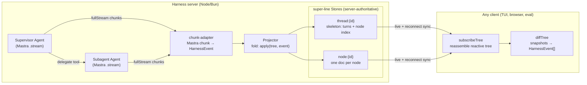
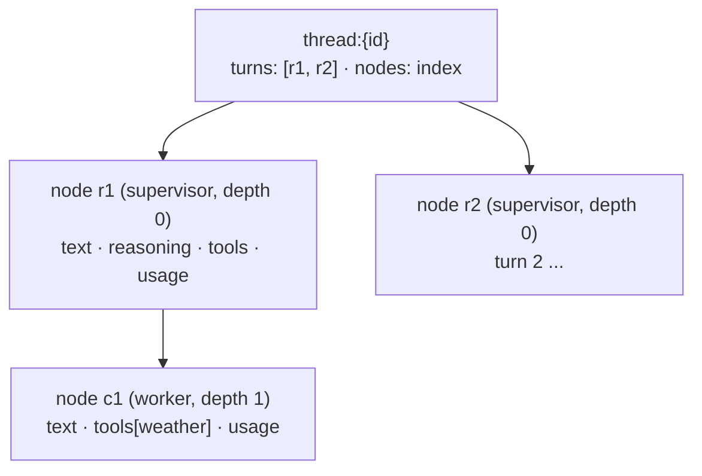

# Super Harness

> The missing piece that makes building and debugging AI applications easy and transparent.

Super Harness is a **generic agent harness** for TypeScript. You bring [Mastra](https://mastra.ai) `Agent`s — your models, memory, and tools — and the harness gives you a supervisor/subagent runtime whose every step is **persisted, streamed, and replayable** in real time. The whole run is a live tree you can subscribe to from a terminal, a browser, or an eval.

It is a thin layer over two foundations: **Mastra `Agent`** is the engine at every node, and a per-node **[super-line](https://super-line.dogar.biz/) Store** is the single transport — the same Store both persists a node's progress and streams it to clients, so persistence, live streaming, and reconnect/late-join are one mechanism instead of three.

The two layers are separate packages: `@super-harness/core` hosts the harness itself — an [AgentController](https://mastra.ai/docs/agent-controller/overview)-style session runtime, importable in any project, no transport, no super-line — and `@super-harness/server` exposes a harness over super-line with one call (`serve`). Unlike AgentController, the supervisor **and every subagent are real Mastra `Agent` instances you own**, and delegation streams at full fidelity at every depth.

## Why

Building on a raw agent SDK, you re-solve the same plumbing every time: how do subagent tool calls get persisted so you can fetch them later; how does a supervisor spawn and track many subagents; how does progress — main *and* nested — stream to a UI without bespoke event wiring per surface. Mastra's `AgentController` bundles an opinionated answer, but it's limiting: coarse `subagent_*` forwarding loses fidelity below the top level, and the transport is baked in.

Super Harness makes three guarantees the design is built around:

1. **Subagent tool calls are persisted** — every call, at every depth, folded into a durable per-node document you can fetch or replay any time.
2. **A supervisor orchestrates many subagents** — arbitrary, depth-gated delegation; each subagent is a first-class node with its own thread.
3. **Everything streams** — main agent *and* every subagent, with full fidelity (reasoning deltas, tool-input deltas, results), over one transport.

## Features

- **Full-fidelity nested streaming.** The same chunk mapper runs at every depth, so a subagent's reasoning and tool-input deltas stream just like the supervisor's — not flattened to `subagent_started`/`subagent_finished`.
- **Store-as-transport.** Each node's progress lives in a super-line Store Resource. That single document is the persistence *and* the live stream *and* the reconnect/late-join snapshot. No separate event log to reconcile with state.
- **Read a session from anywhere.** An isomorphic client view (`subscribeTree` + `diffTree`) reassembles the reactive tree from Store Resources and turns any two snapshots into an incremental `HarnessEvent` stream. The TUI, a browser chat, and an eval all read the same way.
- **Batteries-included built-ins.** `delegate` (spawn a subagent), `ask_user` (root-only human-in-the-loop via tool suspend/resume), and `todo` (a plan surface) come wired.
- **A session runtime, not just a run loop.** Typed event bus (`subscribe`), follow-up queue + `steer`, a suspension registry (parallel `ask_user`s by `toolCallId`), tool approvals with permission rules and session grants, per-thread modes (instruction overlays + tool allowlists), and thread management over Mastra Memory (with optional auto-titling from the first message, broadcast live to every tab).
- **Durable by default.** SQLite-backed Stores out of the box; in-memory for tests.
- **Terminal client included.** An OpenTUI cockpit for developers and a `--headless` stdin/stdout shell for agents — both drive any harness server over super-line.

## Packages

| Package | What it is |
|---|---|
| [`@super-harness/core`](packages/core) | The harness: `createHarness` returns a transport-free, AgentController-style host — delegation graph (`delegatesTo` edges, depth-gated), event bus, follow-up queue + steer, suspensions, approvals + permissions, modes, threads, and the fold to one live tree per thread. Depends only on `shared` plus `nanoid`/`zod`, with Mastra as a peer — no super-line, no transport. |
| [`@super-harness/server`](packages/server) | The super-line binding: `serve(harness, config)` — durable per-node/thread Stores, the wire contract (turns, approvals, modes, threads), and room broadcast of the ephemeral signals. |
| [`@super-harness/shared`](packages/shared) | The isomorphic wire layer: the super-line contract, the `HarnessEvent` union, the tree types + fold (`apply`), and the client-side Store view (`subscribeTree` + `diffTree`). No Mastra, no server deps — safe in the browser, Bun, and Node. |
| [`@super-harness/react`](packages/react) | The headless React client: a framework-free `HarnessClient` (wire state machine — join, `subscribeTree`, ask/approval lifecycle, modes, live thread list, reconnect) plus `HarnessProvider`/`useHarness` hooks. No components — bring your own. |
| [`@super-harness/tui`](packages/tui) | The terminal client — OpenTUI cockpit + headless shell. Runs on Bun. |
| [`examples/dev-server`](examples/dev-server) | A runnable server: a supervisor delegating to a `worker` subagent with a live weather tool. What the quickstart below runs. |
| [`examples/web`](examples/web) | Fullstack showcase — a Hono harness backend and a Vite/React/shadcn/ai-elements client (live tree, approvals, modes, cross-tab thread list). |
| [`examples/plan-board`](examples/plan-board) | Todo/task showcase — a scripted planner and a plan-first client (web's shadcn/ai-elements stack) rendering the live plan checklist, delegation, ask_user, and an approval gate. |

## Quickstart

### Prerequisites

- [pnpm](https://pnpm.io) `11.5+` (the workspace package manager)
- [Bun](https://bun.sh) `1.1+` — the TUI uses `@opentui` (which needs `bun:ffi`); the dev-server also runs under Bun
- An [AI Gateway](https://vercel.com/docs/ai-gateway) API key for the demo's models

```bash
pnpm install
```

### Run the demo

The demo is a two-terminal flow: a harness **server** and the **tui** client that connects to it.

```bash
# 1. put your gateway key in the repo-root .env
cp .env.example .env
$EDITOR .env            # set AI_GATEWAY_API_KEY=...   (optional: CHAT_MODEL=anthropic/claude-haiku-4.5)

# 2. terminal one — start the server (Bun)
pnpm -F @super-harness/dev-server start          # -> ws://localhost:4111/super-line

# 3. terminal two — drive it with the interactive cockpit
pnpm -F @super-harness/tui start -- --url ws://localhost:4111/super-line
```

Type `What's the weather in Istanbul?` — the supervisor delegates to the `worker` subagent, which calls the live weather tool; you watch both lanes stream in real time. Then ask it again in the same session to see the thread accumulate.

For agents (or CI), the same client runs headless over stdin/stdout:

```bash
pnpm -F @super-harness/tui start -- --headless --url ws://localhost:4111/super-line
```

### Use it as a library

`createHarness` (from `@super-harness/core`) takes your Mastra `Agent`s and returns a transport-free host — the AgentController-style session runtime. `serve` (from `@super-harness/server`) exposes it over super-line, where the Stores stream and persist the tree. You own the agents (models, memory, tools); the harness owns delegation, event reduction, and state consolidation.

```ts
import { createServer } from 'node:http'
import { Agent } from '@mastra/core/agent'
import { gateway } from '@ai-sdk/gateway'
import { webSocketServerTransport } from '@super-line/transport-websocket'
import { createHarness } from '@super-harness/core'
import { serve } from '@super-harness/server'

const worker = new Agent({
  id: 'worker',
  name: 'Worker',
  instructions: 'A focused worker. Use your tools, then report a short, concrete result.',
  model: gateway('anthropic/claude-haiku-4.5'),
  tools: { /* your tools */ },
})

const supervisor = new Agent({
  id: 'supervisor',
  name: 'Supervisor',
  instructions: 'Coordinate the `worker` subagent. Delegate data tasks; summarize the result.',
  model: gateway('anthropic/claude-haiku-4.5'),
})

const harness = createHarness({
  supervisor,
  subagents: [{ agent: worker }],      // + { recall, delegatesTo, maxSteps } per subagent
  maxDepth: 3,                          // gate delegation depth
  // all optional:
  memory,                               // MastraMemory — enables harness.threads.* + mode persistence
  modes: [{ id: 'plan', instructions: 'Plan only.', metadata: { default: true } }, { id: 'build' }],
  permissions: { tools: { deploy: 'ask' }, categories: { execute: 'ask' } },
  toolCategoryResolver: (name) => (name.startsWith('run_') ? 'execute' : null),
})

const httpServer = createServer()
await serve(harness, {
  storage: { type: 'sqlite', path: './harness.db' },   // or { type: 'memory' }
  transports: [webSocketServerTransport({ server: httpServer, path: '/super-line' })],
})
httpServer.listen(4111)
```

`createHarness` config:

| Field | Type | Notes |
|---|---|---|
| `supervisor` | `Agent` | The root node's agent. Always gets `ask_user` and `todo`; gets `delegate` when it has delegation edges (i.e. any subagents). |
| `delegatesTo` | `string[] \| true` | The supervisor's delegation edges. Default: every subagent. |
| `subagents` | `SubagentConfig[]` | `{ agent, delegatesTo?, recall?, maxSteps? }`. A subagent may delegate only along its `delegatesTo` edges (`true` = everyone; default: none). |
| `maxDepth` | `number` | Max delegation depth. Default `3`. |
| `modes` | `HarnessMode[]` | Per-thread operating profiles: `{ id, instructions?, availableTools?, metadata? }`. Mode instructions layer onto the supervisor's own; `availableTools` is an LLM-visible allowlist. `metadata.default: true` marks the default. |
| `defaultModeId` | `string` | Explicit default mode; beats `metadata.default`, else the first mode is the default. |
| `resourceFor` | `(threadId) => string` | Maps a thread to its Mastra memory `resourceId`. Default: the threadId itself. |
| `memory` | `MastraMemory` | Enables `harness.threads.*` (list/create/rename/delete) and per-thread mode persistence. |
| `generateTitle` | `boolean \| { model?, instructions? }` | Auto-title a thread from its first user message once the turn settles (needs `memory`). Runs the supervisor's `generateTitleFromUserMessage`; the result relays as a `thread_renamed` event so live clients update without a reload. |
| `permissions` | `PermissionRules` | `allow \| ask \| deny` per tool and per category. Per-tool `deny` beats everything (even yolo); unresolved gated tools default to `ask`. Built-ins never gate. |
| `toolCategoryResolver` | `(toolName) => ToolCategory \| null` | Maps tools to `read/edit/execute/mcp/other` for category policies and grants. |

### Drive it — the session runtime

The harness is the AgentController analogue: subscribe once, then talk to it. Works identically before and after `serve()` — the wire contract maps 1:1 onto these methods.

```ts
const unsub = harness.subscribe((threadId, e) => {
  switch (e.type) {
    case 'text_delta':          // per-node, full fidelity (nodeId/parentNodeId/depth)
      break
    case 'suspended':           // ask_user is waiting — resume({ threadId, resumeData })
      break
    case 'approval_required':   // a gated tool — respondToApproval({ threadId, decision })
      break
    case 'tree_changed':        // e.tree — or getTree(threadId) any time
      break
  }
})

const res = await harness.sendMessage({ threadId, content: 'build me X' })
// { status: 'done', text, usage } | { status: 'suspended', suspension }
// | { status: 'error', error, text } | { status: 'queued', queued }  (busy thread)

await harness.steer({ threadId, content: 'stop — do Y instead' })  // abort + clear queue + send
await harness.resume({ threadId, resumeData: { answer: 'yes' } })  // answer an ask_user
await harness.respondToApproval({ threadId, decision: 'always_allow' })
await harness.switchMode(threadId, 'build')                        // emits mode_changed, persists
const threads = await harness.threads.list()                       // needs `memory`
harness.abort(threadId)   // stops the turn, declines parked approvals, drops the queue
```

Gated tool calls follow Mastra's native flow: the run suspends on the approval, and `approveToolCall`/`declineToolCall` resume it with a continuation stream the harness keeps driving on the same node. Approval gating and mode overlays apply to the **root** (supervisor) node only — subagents run headless with constrained tools, matching AgentController.

### Read a session from a client

Any client reads a session the same way — open the thread + node Store Resources and fold them into a reactive tree, or diff two snapshots into an incremental event stream:

```ts
import { subscribeTree, diffTree, emptyTree } from '@super-harness/shared'

let prev = emptyTree()
const stop = subscribeTree(client, threadId, (tree) => {
  for (const event of diffTree(prev, tree)) {
    // event: text_delta, tool_start, tool_end, node_start, node_end, todo, error, ...
    console.log(event.depth, event.type)
  }
  prev = tree
})
```

## Architecture

### The core idea: the Store is the single transport

Most agent frameworks carry three separate mechanisms: an **event stream** (live progress to the UI), a **persistence layer** (so you can fetch a run later), and some **snapshot/replay** path (so a late-joining or reconnecting client can catch up). Keeping those three consistent is where the bugs live.

Super Harness collapses them into one. Each node's progress is a **super-line Store Resource** — a permissioned, server-authoritative JSON document that fans out to subscribed clients in real time and is durably persisted by its backend. Writing a node's next token to its Store *is* streaming it, *is* persisting it, and *is* what a reconnecting client reads to catch up. There is no second event log to reconcile.

The server is the **sole writer** of every Store. That's what makes the design simple: no client-side merge, no conflict resolution, no CRDT needed. Clients only ever read.

### Data flow



The supervisor and every subagent are ordinary Mastra `Agent`s. The harness drives each with `agent.stream()`, maps its `fullStream` chunks to `HarnessEvent`s, folds those into the per-node and thread Store Resources, and clients read them back. The delegate call on the parent is *suppressed* as a tool in the parent's transcript — the child node stands in for it, so a delegation reads as a nested lane rather than an opaque tool result.

### The tree

A session is a tree of nodes. The **thread** Store holds the skeleton (`turns` — the root node per user turn — and a node index with parent/depth/children). Each **node** Store holds that one node's live state.



`NodeState` accumulates `status`, `reasoning`, `text`, an ordered `tools` map (`argsText` → `args`, `result`, per-tool `status`), `childOrder`, `usage`, `durationMs`, and `error`. `ThreadDoc` carries `turns`, the node index, and `todos`. The fold that builds them, `apply(tree, event)`, lives in `@super-harness/shared` and runs on the server (the Projector); clients skip the fold entirely — `subscribeTree` reassembles the tree straight from the Store snapshots and `diffTree` recovers an event stream from them.

### The event vocabulary

Every progress signal is a `HarnessEvent` — a zod discriminated union with a common envelope (`nodeId`, `parentNodeId`, `depth`, `agentType`) so any consumer knows *which* node and *how deep* without extra context.

| Event | Meaning |
|---|---|
| `node_start` / `node_end` | A node (supervisor or subagent) begins / finishes (`reason`, `usage`, `durationMs`). |
| `reasoning_delta` / `reasoning_done` | Streaming reasoning tokens / the coalesced full reasoning. |
| `text_delta` / `text_done` | Streaming output tokens / the coalesced full text. |
| `tool_input_start` / `tool_input_delta` | A tool call begins; its arguments stream in. |
| `tool_start` / `tool_end` | Arguments are ready (call about to run) / the result (or `isError`) returned. |
| `todo` | The current plan (from the `todo` built-in). |
| `error` | A node-level error. |

### Server side

`serve(harness, config)` (in `@super-harness/server`) wires a super-line server with two Store namespaces (`harness.node`, `harness.thread`) and the control-plane contract, subscribed to the harness bus. It is a thin standalone host over two composable exports — `harnessStores(storage)` and `mountHarness(srv, harness)` — that a **host app with its own super-line server** uses instead: merge `harnessSurface` into the contract's `shared` block, spread the stores and handlers, and the harness rides the host's socket and auth (see `examples/composed-host`).

- **`Harness`** (in `@super-harness/core`) is the session runtime. `sendMessage` drives the supervisor node (or queues a follow-up on a busy thread); the `delegate` built-in spawns child nodes along the agent's `delegatesTo` edges (depth-gated by `maxDepth`); `ask_user` parks a suspension in the per-thread registry; gated tools park an approval; every event lands on the bus after the fold.
- **run-node** drives one node's `agent.stream()` (or `agent.resumeStream()`), injecting a `RequestContext` carrying the harness runtime and the built-in toolset. A `tool-call-approval` chunk suspends the run (the stream closes); run-node returns the parked approval and the Harness resolves it via `agent.approveToolCall`/`declineToolCall`, driving the returned continuation stream through the same node.
- **chunk-adapter** maps each Mastra `fullStream` chunk to `HarnessEvent` bodies — and suppresses the parent-level tool chunks for a `delegate` call (the child node represents it).
- **Projector** folds those events into one live tree per thread via `apply` — the harness's own copy backs `getTree`/`tree_changed`; `serve` runs a second fold into the Store-backed sink.
- **sink** (`superlineTreeSink`, in `@super-harness/server`) is the durable write path: it `create`s each Resource (granted to the thread's principals) before `open`ing it, so a client that opens the Resource always finds a live, readable handle. The port it implements (`TreeSink`) is two methods — that's the whole seam a custom persistence layer fills.
- **Ephemeral signals** split by axis. Content signals (`harness.suspended`, `harness.approvalRequired`, `harness.modeChanged`, `harness.followUpQueued`) broadcast to the per-**thread** room (`harness:thread:{id}`); thread-list signals (`harness.threadCreated`, `harness.threadRenamed`, `harness.threadDeleted`) broadcast to the per-**resource** room (`harness:resource:{id}`), so every one of a resource's tabs keeps its sidebar in sync whatever thread each is viewing. Requests (`harness.respondToApproval`, `harness.switchMode`, `harness.listThreads`, …) map 1:1 onto Harness methods.

### The contract

The tree itself does **not** ride the super-line contract — it rides the Stores. The contract carries only the turn **control plane** plus the one signal that is genuinely ephemeral (not state). It is exported as `harnessSurface`, a composable `defineSurface` fragment whose keys are all `harness.`-prefixed so a host contract can merge it collision-free:

- `harness.join(threadId)` — join the thread's room; the server pre-creates the thread Resource granted to this connection (a client `open()` on a not-yet-existent Resource is a dead handle, so it must exist before the client subscribes).
- `harness.sendMessage(threadId, message)` — start a turn (queued server-side if one is running).
- `harness.resumeMessage(threadId, toolCallId?, resumeData)` — answer a pending `ask_user`.
- `harness.respondToApproval(threadId, toolCallId?, decision, message?)` — resolve a gated tool call (`approve/decline/always_allow/always_allow_category`).
- `harness.switchMode` / `harness.listModes` — per-thread mode control.
- `harness.listThreads` / `harness.createThread` / `harness.renameThread` / `harness.deleteThread` — thread management (needs `memory` on the harness). Scoping is opt-in: a connection that carries a `resourceId` gets a list scoped to it and creates pinned to it (server-authoritative); without one, the list is unscoped — backward-compatible with the tui/dev-server.
- `harness.abort(threadId)` — abort the running turn.
- Events (server→client): content signals on the thread room — `harness.suspended` (an `ask_user` prompt is waiting), `harness.approvalRequired` (a gated tool wants a decision), `harness.modeChanged`, `harness.followUpQueued` — and thread-list signals on the resource room — `harness.threadCreated`, `harness.threadRenamed` (also carries auto-generated titles), `harness.threadDeleted`. All ephemeral — requests for input or sidebar deltas, not durable state — so they're events rather than Store writes.

### Built-in tools

| Tool | Available to | Effect |
|---|---|---|
| `delegate` | any agent with `delegatesTo` edges | Spawn a subagent node along an edge (depth-gated, edge-enforced). The child becomes a nested lane; the delegate call is suppressed in the parent's tool transcript. |
| `ask_user` | root node only | Suspend the run for human input (Mastra tool suspend/resume), surfaced as a `suspended` event; the turn resumes on `resumeMessage`. |
| `todo` | every node | Publish a plan/checklist onto the thread. |

### Persistence & storage

Stores are durable through their backend. `storage: { type: 'sqlite', path }` (the default) persists every node and thread to SQLite — fetch or replay any run, at any depth, at any time. `storage: { type: 'memory' }` keeps it all in memory for tests and quick dev loops. To reuse a database the app already owns, `{ type: 'libsql', client }` or `{ type: 'postgres', db }` write `superline_*` tables beside your own (no second file, no native build); `{ type: 'pglite', pgUrl, electricUrl }` is the multi-node option — central Postgres with per-node Electric-synced replicas. Because the server is the sole writer, no CRDT is involved; the Store uses last-write-wins semantics, which is all a single writer needs.

### A note on version skew

The super-line ecosystem spans several independently-versioned packages. The server-side set is owned by `@super-harness/server` (one package.json pins a coherent set); `@super-harness/shared` pins only `@super-line/core` for `defineContract`, the tui pins its own client-side set, and `@super-harness/core` imports none of them. The SQLite Store backend is still **dynamically imported** only when selected, so the `better-sqlite3` native build is only required if you use it.

## Terminal client

The `tui` package is one binary with two faces, selected by `--headless` (auto-on when stdout isn't a TTY).

**Cockpit** (interactive) renders the live node tree, streaming lanes, and an input line. **Headless** emits a line-oriented stdin/stdout protocol for agents and CI — machine-parseable status markers plus rendered transcript lines.

Flags:

| Flag | Default | Meaning |
|---|---|---|
| `--url <ws>` | `ws://localhost:4111/super-line` (or `$SUPER_HARNESS_URL`) | Harness server to connect to. |
| `--user <id>` | `local` | `userId` sent at handshake. |
| `--thread <id>` | random | Thread to join; omit for a fresh one. |
| `--headless` | auto if not a TTY | stdin/stdout shell instead of the cockpit. |
| `--json` | off | Emit events as JSON (suppresses the human transcript). |
| `--verbose` / `--full` | off | More detail per line / untruncated content. |
| `--control <path>` | — | Headless control FIFO (`mkfifo`'d if missing): pipe commands via `echo "/send …" > <path>`; reopened after each writer, only `/quit` exits. |
| `--spill-dir <path>` | `/tmp/super-harness-<pid>` | Where large tool payloads spill. |

Commands (typed in the cockpit, or piped to headless stdin):

```
/send <text>      start a turn (queued server-side if one is running)
/reply <text>     answer a pending ask_user (yes/y for approvals)
/approve [note]   approve the pending tool call
/deny [note]      decline the pending tool call
/always           approve + always-allow this tool for the session
/mode [id]        switch mode, or list modes when no id given
/threads          list threads on the server
/abort            abort the running turn
/session          print thread / connection info
/new [threadId]   start a fresh thread
/help             this list
/quit             disconnect and exit
```

Headless status markers (on stdout):

```
<<SPILL dir=...>>                          large payloads spill here
<<READY>>                                  connected and joined
<<CONTROL fifo=...>>                       control FIFO announced (with --control)
<<TURN_START runId=...>>                   a turn began
<<TURN_DONE tools=N errors=N tokens=N>>    a turn finished
<<SUSPENDED tool=... request=... [schema=...]>>   an ask_user awaits /reply
<<APPROVAL_REQUIRED tool=... args=...>>    a gated tool awaits /approve or /deny
<<INFO ...>>                               notices (mode changes, follow-ups queued, …)
<<ERROR ...>>                              connect/command failure
<<DISCONNECTED>> / <<RECONNECTED>>         connection dropped / recovered (pending state resets)
<<RESUME pnpm -F @super-harness/tui ...>>  printed on exit — the exact command to rejoin this thread
```

## Development

```bash
pnpm install
pnpm build          # tsup (core & server; shared/tui are source-run, no build step)
pnpm test           # vitest, all packages
pnpm typecheck      # tsc --noEmit
pnpm lint           # oxlint
pnpm format         # oxfmt   (format:check to verify)
```

Layout:

```
packages/
  shared/     isomorphic wire layer (contract, events, tree, client-view)
  core/       the harness (createHarness: bus, queue, approvals, modes, threads)
  server/     super-line binding (serve, contract impl, Store sink)
  react/      headless React client (HarnessClient + provider/hooks, no UI)
  tui/        terminal client (OpenTUI cockpit + headless shell) — Bun
examples/
  dev-server/        runnable supervisor + worker demo
  web/               fullstack Hono backend + Vite/React/shadcn client
  plan-board/        todo/task showcase (scripted planner + shadcn/ai-elements client)
  mastra-playground/ standalone Mastra scratchpad (not wired to the harness)
```

Runtime notes: `core`, `server`, and `shared` are Node/Bun; the `tui` requires **Bun** (OpenTUI's `bun:ffi`). Packages are source-exported (`main`/`types` point at `./src/index.ts`) so the workspace runs without a build step during development. The SQLite backend needs `better-sqlite3` built (`pnpm approve-builds` / `allowBuilds` in `pnpm-workspace.yaml`).

## License

[MIT](LICENSE) © Mert Dogar
