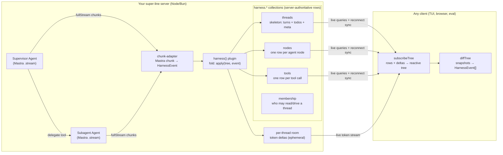

# Super Harness

> The missing piece that makes building and debugging AI applications easy and transparent.

Super Harness is a **generic agent harness** for TypeScript. You bring
[Mastra](https://mastra.ai) `Agent`s — your models, memory, and tools — and the
harness gives you a supervisor/subagent runtime whose every step is
**persisted, streamed, and replayable** in real time. The whole run is a live
tree you can subscribe to from a terminal, a browser, or an eval.

It is a thin layer over two foundations: **Mastra `Agent`** is the engine at
every node, and [super-line](https://github.com/mertdogar/super-line) is the
wire. The harness ships as a **super-line plugin**: if you already run a
super-line server, a full multi-agent harness — delegation, full-fidelity
streaming, HITL approvals, threads, modes — drops into your app with one
`plugins: [harness(engine)]` line, riding your existing socket, contract,
auth, and storage. No separate service, no second connection.

The engine and the wire are separate packages: `@super-harness/core` hosts the
harness itself — an [AgentController](https://mastra.ai/docs/agent-controller/overview)-style
session runtime, importable in any project, no transport, no super-line — and
`@super-harness/server` binds it to super-line, either as a plugin on your own
server or standalone via `serve()`. Unlike AgentController, the supervisor
**and every subagent are real Mastra `Agent` instances you own**, and
delegation streams at full fidelity at every depth.

## Why

Building on a raw agent SDK, you re-solve the same plumbing every time: how do
subagent tool calls get persisted so you can fetch them later; how does a
supervisor spawn and track many subagents; how does progress — main *and*
nested — stream to a UI without bespoke event wiring per surface. Mastra's
`AgentController` bundles an opinionated answer, but it's limiting: coarse
`subagent_*` forwarding loses fidelity below the top level, and the transport
is baked in.

Super Harness makes three guarantees the design is built around:

1. **Subagent tool calls are persisted** — every call, at every depth, lands as
   a typed row you can query, fetch, or replay any time.
2. **A supervisor orchestrates many subagents** — arbitrary, depth-gated
   delegation; each subagent is a first-class node with its own lane.
3. **Everything streams** — main agent *and* every subagent, with full fidelity
   (reasoning deltas, tool-input deltas, results), over one connection.

## Features

- **Full-fidelity nested streaming.** The same chunk mapper runs at every
  depth, so a subagent's reasoning and tool-input deltas stream just like the
  supervisor's — not flattened to `subagent_started`/`subagent_finished`.
- **Typed collections as the tree transport.** The durable session tree rides
  four super-line **collections** (`harness.threads`/`nodes`/`tools`/
  `membership`) — schema-validated rows, live queries, row-level security. The
  same rows are the persistence, the live structural stream, and the
  reconnect/late-join snapshot. Token deltas ride ephemeral per-thread room
  events and are never persisted per-token.
- **One-line adoption.** `harnessContract()` merges the harness surface +
  collections into your contract; `harness(engine)` plugs the runtime into your
  server. Every `harness.*` handler is subtracted from your `implement()`, so
  you implement only your own requests.
- **Read a session from anywhere.** An isomorphic client view (`subscribeTree`
  + `diffTree`) assembles the reactive tree from the collection subscriptions
  plus the token-delta events, and turns any two snapshots into an incremental
  `HarnessEvent` stream. The TUI, a browser chat, and an eval all read the same
  way.
- **Batteries-included built-ins.** `delegate` (spawn a subagent), `ask_user`
  (root-only human-in-the-loop via tool suspend/resume), and `todo` (a plan
  surface) come wired.
- **A session runtime, not just a run loop.** Typed event bus (`subscribe`),
  follow-up queue + `steer`, a suspension registry (parallel `ask_user`s by
  `toolCallId`), tool approvals with permission rules and session grants,
  per-thread modes (instruction overlays + tool allowlists), and thread
  management over Mastra Memory (with optional auto-titling from the first
  message, relayed live to every tab).
- **Durable by default.** SQLite-backed collections out of the box; in-memory
  for tests; PGlite + Electric for multi-node.
- **Terminal client included.** An OpenTUI cockpit for developers and a
  `--headless` stdin/stdout shell for agents — both drive any harness server
  over super-line.

## Packages

| Package | What it is |
|---|---|
| [`@super-harness/core`](packages/core) | The engine: `createHarness` returns a transport-free, AgentController-style host — delegation graph (`delegatesTo` edges, depth-gated), event bus, follow-up queue + steer, suspensions, approvals + permissions, modes, threads, and the fold to one live tree per thread. Depends only on `shared` plus `nanoid`/`zod`, with Mastra as a peer — no super-line, no transport. |
| [`@super-harness/server`](packages/server) | The super-line binding: `harness(engine)` — a `SuperLinePlugin` (RLS policies, `harness.*` handlers, the bus→collections setup) for hosts with their own server — and `serve(engine, config)`, the same pieces standalone. |
| [`@super-harness/shared`](packages/shared) | The isomorphic wire layer: `harnessContract()` (the contract-plugin fragment), the collection row schemas, the `HarnessEvent` union, the tree types + fold (`apply`), and the client view (`subscribeTree` + `diffTree`). No Mastra, no server deps — safe in the browser, Bun, and Node. |
| [`@super-harness/react`](packages/react) | The headless React client: a framework-free `HarnessClient` (wire state machine — join, `subscribeTree`, ask/approval lifecycle, modes, live thread list, reconnect) plus `HarnessProvider`/`useHarness` hooks. No components — bring your own. |
| [`@super-harness/tui`](packages/tui) | The terminal client — OpenTUI cockpit + headless shell. Runs on Bun. |
| [`examples/plugin-usage`](examples/plugin-usage) | The getting-started showcase: a host adds the harness with one plugin line, driven by a self-contained `diffTree()` streaming terminal client. **Start here.** |
| [`examples/dev-server`](examples/dev-server) | A runnable server: a supervisor delegating to a `worker` subagent with a live weather tool. What the quickstart below runs. |
| [`examples/composed-host`](examples/composed-host) | The composition reference: a host super-line server mounting the harness beside its own surface, one shared client. |
| [`examples/auth`](examples/auth) | The harness plugin paired with `@super-line/plugin-auth`: real sign-up/sign-in, identity → the collection principal, one socket. |
| [`examples/web`](examples/web) | Fullstack showcase — a Hono harness backend and a Vite/React/shadcn/ai-elements client (live tree, approvals, modes, cross-tab thread list). |
| [`examples/plan-board`](examples/plan-board) | Todo/task showcase — a scripted planner and a plan-first client (web's shadcn/ai-elements stack) rendering the live plan checklist, delegation, ask_user, and an approval gate. |
| [`examples/canvas`](examples/canvas) | The CRDT/cluster flagship — the agent as a first-class co-writer on a shared CRDT canvas (its tool calls merge live with your drags), TanStack DB boards lobby, approval-gated `clear_board`, and a 2-node Postgres+Electric cluster. |
| [`examples/mastra-playground`](examples/mastra-playground) | Standalone Mastra scratchpad — not wired to the harness. |

## Quickstart

### Prerequisites

- [pnpm](https://pnpm.io) `11.5+` (the workspace package manager)
- [Bun](https://bun.sh) `1.1+` — the TUI uses `@opentui` (which needs
  `bun:ffi`); the example servers also run under Bun
- An [AI Gateway](https://vercel.com/docs/ai-gateway) API key for the demo's
  models

```bash
pnpm install
```

### Run the demo

The demo is a two-terminal flow: a harness **server** and the **tui** client
that connects to it.

```bash
# 1. put your gateway key in the repo-root .env
cp .env.example .env
$EDITOR .env            # set AI_GATEWAY_API_KEY=...   (optional: CHAT_MODEL=anthropic/claude-haiku-4.5)

# 2. terminal one — start the server (Bun)
pnpm -F @super-harness/dev-server start          # -> ws://localhost:4111/super-line

# 3. terminal two — drive it with the interactive cockpit
pnpm -F @super-harness/tui start -- --url ws://localhost:4111/super-line
```

Type `What's the weather in Istanbul?` — the supervisor delegates to the
`worker` subagent, which calls the live weather tool; you watch both lanes
stream in real time. Then ask it again in the same session to see the thread
accumulate.

For agents (or CI), the same client runs headless over stdin/stdout:

```bash
pnpm -F @super-harness/tui start -- --headless --url ws://localhost:4111/super-line
```

### Add it to your super-line app — one line

If you already run a super-line server, the harness is a plugin. Merge the
contract fragment, add the server plugin, and your existing socket carries a
full multi-agent harness beside your own surface
([`examples/plugin-usage`](examples/plugin-usage) is this, runnable):

```ts
// contract.ts — your contract, plus one fragment
import { defineContract, defineSurface } from '@super-line/core'
import { harnessContract } from '@super-harness/shared'

export const app = defineContract({
  plugins: [harnessContract()],        // ← the harness surface + the four harness.* collections
  shared: defineSurface({ /* your own requests */ }),
  roles: { user: {} },
})

// server.ts — your server, plus one plugin
import { createSuperLineServer } from '@super-line/server'
import { memoryCollections } from '@super-line/collections-memory'
import { createHarness } from '@super-harness/core'
import { harness } from '@super-harness/server'

const engine = createHarness({ supervisor, subagents: [{ agent: researcher }] })

const srv = createSuperLineServer(app, {
  transports,
  collections: memoryCollections(),    // ONE backend serves the harness + your own collections
  authenticate,
  identify: (conn) => conn.ctx.userId, // → the principal the harness RLS keys on
  plugins: [harness(engine)],          // ← harness.* is subtracted from implement()
})
srv.implement({ shared: { /* only YOUR handlers */ }, user: {} })
```

The four host obligations, spelled out:

1. **Merge the fragment** — `harnessContract()` in your contract's `plugins`.
   It contributes the harness surface (requests + streaming events, on
   `shared`) and the four `harness.*` collections
   (`threads`/`nodes`/`tools`/`membership`). Every key is `harness.`-prefixed,
   so a collision with your own surface is impossible.
2. **One collections backend** — `memoryCollections()` /
   `sqliteCollections()` / `pgliteCollections()`. It serves the harness
   collections beside any of your own; the harness never owns a backend.
3. **`identify` → your principal** — the harness's row-level security keys on
   `ctx.userId`, and super-line's principal falls back to a random connection
   id. Skip `identify` and you get a working request surface and a **silently
   empty tree** — every membership-gated read denied.
4. **Add the plugin** — `harness(engine)` in `plugins`. Every `harness.*`
   handler key is subtracted from `implement()`, so you implement only your
   own requests.

### Or run it standalone — `serve()`

`serve(engine, config)` is the same pieces on their own server: it owns the
collections backend, a default query-param `authenticate` + `identify`
(dev/trusted only — pair with `@super-line/plugin-auth` in production), and a
`plugins` passthrough to compose `inspector()` or `auth()` beside the harness.

```ts
import { createServer } from 'node:http'
import { webSocketServerTransport } from '@super-line/transport-websocket'
import { createHarness } from '@super-harness/core'
import { serve } from '@super-harness/server'

const engine = createHarness({
  supervisor,
  subagents: [{ agent: worker }],       // + { recall, delegatesTo, maxSteps } per subagent
  maxDepth: 3,                          // gate delegation depth
  // all optional:
  memory,                               // MastraMemory — enables engine.threads.* + mode persistence
  modes: [{ id: 'plan', instructions: 'Plan only.', metadata: { default: true } }, { id: 'build' }],
  permissions: { tools: { deploy: 'ask' }, categories: { execute: 'ask' } },
  toolCategoryResolver: (name) => (name.startsWith('run_') ? 'execute' : null),
})

const httpServer = createServer()
await serve(engine, {
  storage: { type: 'sqlite', file: './harness.db' },   // or { type: 'memory' } | { type: 'pglite', pgUrl }
  transports: [webSocketServerTransport({ server: httpServer, path: '/super-line' })],
})
httpServer.listen(4111)
```

`createHarness` config:

| Field | Type | Notes |
|---|---|---|
| `supervisor` | `Agent` | The root node's agent. Always gets `ask_user` and `todo`; gets `delegate` when it has delegation edges (i.e. any subagents). |
| `delegatesTo` | `string[] \| true` | The supervisor's delegation edges. Default: every subagent. |
| `subagents` | `SubagentConfig[]` | `{ agent, delegatesTo?, recall?, maxSteps? }`. A subagent may delegate only along its `delegatesTo` edges (`true` = everyone; default: none). |
| `maxSteps` | `number` | Root-turn step budget for the supervisor (Mastra's `maxSteps`). Unset = Mastra's default. |
| `maxDepth` | `number` | Max delegation depth. Default `3`. |
| `modes` | `HarnessMode[]` | Per-thread operating profiles: `{ id, instructions?, availableTools?, metadata? }`. Mode instructions layer onto the supervisor's own; `availableTools` is an LLM-visible allowlist. `metadata.default: true` marks the default. |
| `defaultModeId` | `string` | Explicit default mode; beats `metadata.default`, else the first mode is the default. |
| `resourceFor` | `(threadId) => string` | Maps a thread to its Mastra memory `resourceId`. Default: the threadId itself. |
| `memory` | `MastraMemory` | Enables thread management (list/create/rename/delete) and per-thread mode persistence. |
| `generateTitle` | `boolean \| { model?, instructions? }` | Auto-title a thread from its first user message once the turn settles (needs `memory`). The result relays as a `thread_renamed` event, landing as a `harness.threads` row update every subscribed tab sees. |
| `permissions` | `PermissionRules` | `allow \| ask \| deny` per tool and per category. Per-tool `deny` beats everything (even yolo); unresolved gated tools default to `ask`. Built-ins never gate. |
| `toolCategoryResolver` | `(toolName) => ToolCategory \| null` | Maps tools to `read/edit/execute/mcp/other` for category policies and grants. |

### Drive it — the session runtime

The engine is the AgentController analogue: subscribe once, then talk to it.
Works identically before and after wiring to super-line — the wire contract
maps 1:1 onto these methods.

```ts
const unsub = engine.subscribe((threadId, e) => {
  switch (e.type) {
    case 'text_delta':          // per-node, full fidelity (nodeId/parentNodeId/depth)
      break
    case 'suspended':           // ask_user is waiting — resume({ threadId, resumeData })
      break
    case 'approval_required':   // a gated tool — respondToApproval({ threadId, decision })
      break
    case 'tree_changed':        // e.tree — or getTree(threadId) any time
      break
  }
})

const res = await engine.sendMessage({ threadId, content: 'build me X' })
// { status: 'done', text, usage } | { status: 'suspended', suspension }
// | { status: 'error', error, text } | { status: 'queued', queued }  (busy thread)

await engine.steer({ threadId, content: 'stop — do Y instead' })  // abort + clear queue + send
await engine.resume({ threadId, resumeData: { answer: 'yes' } })  // answer an ask_user
await engine.respondToApproval({ threadId, decision: 'always_allow' })
await engine.switchMode(threadId, 'build')                        // emits mode_changed, persists
const threads = await engine.threads.list()                       // needs `memory`
engine.abort(threadId)   // stops the turn, declines parked approvals, drops the queue
```

Gated tool calls follow Mastra's native flow: the run suspends on the approval,
and `approveToolCall`/`declineToolCall` resume it with a continuation stream
the harness keeps driving on the same node. Approval gating and mode overlays
apply to the **root** (supervisor) node only — subagents run headless with
constrained tools, matching AgentController.

### Read a session from a client

Any client reads a session the same way — `subscribeTree` assembles the
reactive tree from the collection subscriptions plus the token-delta events,
and `diffTree` turns two snapshots into an incremental event stream:

```ts
import { subscribeTree, diffTree, emptyTree } from '@super-harness/shared'

let prev = emptyTree()
const stop = subscribeTree(client, threadId, (tree) => {
  for (const event of diffTree(prev, tree)) {
    // event: text_delta, tool_start, tool_end, node_start, node_end, todo, error, ...
    console.log(event.depth, event.type)
  }
  prev = tree
})
```

For React, `@super-harness/react` wraps the same machinery in a headless
client — `createHarnessClient({ url })` owns its own socket, or
`createHarnessClient({ client })` borrows your app's existing super-line
client (composition mode: `close()` detaches listeners, never closes the
host's socket). `HarnessProvider`/`useHarness` expose the state machine —
tree, busy, pending ask/approval, modes, live thread list — to your
components; no UI ships, bring your own.

## Architecture

### The core idea: typed collections as the tree transport

Most agent frameworks carry three separate mechanisms: an **event stream**
(live progress to the UI), a **persistence layer** (so you can fetch a run
later), and some **snapshot/replay** path (so a late-joining or reconnecting
client can catch up). Keeping those three consistent is where the bugs live.

Super Harness collapses them by putting the durable tree on super-line
**collections** — server-authoritative, schema-validated rows with row-level
security and live client subscriptions. Writing a node's next structural
change to its row *is* streaming it, *is* persisting it, and *is* what a
reconnecting client reads to catch up. There is no second event log to
reconcile.

One thing is deliberately *not* a row: the token stream. Reasoning, text, and
tool-input **deltas broadcast to the per-thread room** as ephemeral events
(`harness.reasoningDelta`/`textDelta`/`toolInputDelta`) and are never
persisted per-token — the final strings land on the row at
`node_end`/`tool_end`. A live viewer sees every token; a late joiner reads
the settled rows. That split keeps write volume off the database while
keeping the durable state complete.

The plugin is the **sole writer** of every harness row (client writes are
deny-all; the plugin co-writes server-authoritatively). No client-side merge,
no conflict resolution — the collections are last-write-wins, which is all a
single writer needs.

### Data flow



The supervisor and every subagent are ordinary Mastra `Agent`s. The harness
drives each with `agent.stream()`, maps its `fullStream` chunks to
`HarnessEvent`s, folds the structural ones into collection rows, and
broadcasts the token deltas to the thread room. The delegate call on the
parent is *suppressed* as a tool in the parent's transcript — the child node
stands in for it, so a delegation reads as a nested lane rather than an
opaque tool result.

### The four collections

| Collection | Row | Holds |
|---|---|---|
| `harness.threads` | one per thread | The conversation skeleton: `turns` (root nodeIds), `todos`, `title`, `resourceId`, timestamps. Metadata + structure only — content lives on node/tool rows. |
| `harness.nodes` | one per agent node | `status`, final `reasoning`/`text`, `toolOrder`/`childOrder`, `usage`, `durationMs`, `error`, and `pendingResume` (a parked suspension's prompt, so a mid-turn reload rebuilds the `ask_user` UI). Adjacency via `parentNodeId`/`depth`. |
| `harness.tools` | one per tool call | Args (`argsText` → `args`), `result`, per-call `status`. Its own collection so streaming tool input never rewrites the node row. |
| `harness.membership` | one per (user, thread) | The security spine: who may read a thread, with a `role` column (`operator`/`viewer`). |

The client fold tolerates a tool row lagging its node's `toolOrder`;
`subscribeTree` merges the accumulated token deltas over a running node and
treats a settled row as authoritative.

### Security: membership RLS

Reads are governed by row-level security keyed on the connection principal
(`ctx.userId`, supplied by the host's `identify`):

- `harness.nodes`/`harness.tools` — readable only for threads where the
  principal holds a `harness.membership` row.
- `harness.threads` — the sidebar: scoped by the connection's `resourceId`,
  falling back to membership.
- `harness.membership` — each user reads their own rows.
- **Writes are deny-all** for every collection; the plugin writes
  server-authoritatively.

`harness.join` adds the connection to the thread room **and** inserts a
membership row (default role `operator`; `roleFor`/`defaultRole` on the
plugin options override). The **viewer/operator split is that `role` column**
— per-run, not a connection role: control ops
(send/resume/abort/approve/switchMode/rename/delete) reject a `viewer`
membership; read ops don't. That's how a run can be watched live by people
who cannot drive it.

### The event vocabulary

Every progress signal is a `HarnessEvent` — a zod discriminated union with a
common envelope (`nodeId`, `parentNodeId`, `depth`, `agentType`) so any
consumer knows *which* node and *how deep* without extra context. It is what
the engine's bus emits, what `apply` folds, and what `diffTree` recovers on
the client.

| Event | Meaning |
|---|---|
| `node_start` / `node_end` | A node (supervisor or subagent) begins / finishes (`reason`, `usage`, `durationMs`). |
| `reasoning_delta` / `reasoning_done` | Streaming reasoning tokens / the coalesced full reasoning. |
| `text_delta` / `text_done` | Streaming output tokens / the coalesced full text. |
| `tool_input_start` / `tool_input_delta` | A tool call begins; its arguments stream in. |
| `tool_start` / `tool_end` | Arguments are ready (call about to run) / the result (or `isError`) returned. |
| `todo` | The current plan (from the `todo` built-in). |
| `error` | A node-level error. |

### The contract

The tree does **not** ride the contract's requests/events — it rides the
collections. The contract fragment (`harnessContract()`, from
`@super-harness/shared`) contributes the four collections plus the control
plane and the genuinely ephemeral signals, all `harness.`-prefixed so a host
contract merges it collision-free:

- `harness.join(threadId)` — join the thread's room + insert the membership
  row.
- `harness.sendMessage(threadId, message)` — start a turn (queued server-side
  if one is running).
- `harness.resumeMessage(threadId, toolCallId?, resumeData)` — answer a
  pending `ask_user`.
- `harness.respondToApproval(threadId, toolCallId?, decision, message?)` —
  resolve a gated tool call (`approve/decline/always_allow/always_allow_category`).
- `harness.switchMode` / `harness.listModes` — per-thread mode control.
- `harness.listThreads` / `harness.createThread` / `harness.renameThread` /
  `harness.deleteThread` — thread management (needs `memory` on the engine).
  A connection carrying a `resourceId` gets a list scoped to it and creates
  pinned to it (server-authoritative).
- `harness.abort(threadId)` — abort the running turn.
- Events (server→client, per-thread room): the token deltas
  (`harness.reasoningDelta`/`textDelta`/`toolInputDelta`) plus the session
  signals — `harness.suspended` (an `ask_user` prompt is waiting),
  `harness.approvalRequired` (a gated tool wants a decision),
  `harness.modeChanged`, `harness.followUpQueued`. All ephemeral — requests
  for input or live token preview, not durable state.

Thread-list reactivity is **`harness.threads` row deltas**, not events — a
create, rename (including auto-generated titles), or delete is a row change
every subscribed sidebar sees.

On the server, `harness(engine)` implements every one of those handlers and
subtracts them from your `implement()`. Its `setup()` subscribes the engine
bus once: token deltas → room broadcast, structural events → the collections
writer, `thread_deleted` → a cascade delete of the thread's node/tool/
membership rows.

### Built-in tools

| Tool | Available to | Effect |
|---|---|---|
| `delegate` | any agent with `delegatesTo` edges | Spawn a subagent node along an edge (depth-gated, edge-enforced). The child becomes a nested lane; the delegate call is suppressed in the parent's tool transcript. |
| `ask_user` | root node only | Suspend the run for human input (Mastra tool suspend/resume), surfaced as a `suspended` event; the turn resumes on `resumeMessage`. The prompt also parks on the node row (`pendingResume`), so a reload mid-suspension rebuilds it. |
| `todo` | every node | Publish a plan/checklist onto the thread. |

### Persistence & storage

The host owns the ONE collections backend; the harness declares schemas and
policies, never a backend. With `serve()`, `storage` picks it:
`{ type: 'sqlite', file }` (the default) persists every row to SQLite —
fetch or replay any run, at any depth, at any time. `{ type: 'memory' }`
keeps it all in memory for tests and quick dev loops.
`{ type: 'pglite', pgUrl, electricUrl? }` is the multi-node option — central
Postgres with per-node Electric-synced replicas (an optional peer, loaded
only when selected). Because tokens ride the room, only low-frequency
structural rows hit the database — even the replicated backend stays cheap.

(Earlier versions carried the tree on per-node super-line Stores; collections
replaced that design — typed rows, live queries, and RLS where there used to
be whole-document snapshots and per-node ACL grants.)

### A note on versions

super-harness tracks super-line **0.11** (`@super-line/core`/`server`
`^0.11.0`, client `^0.9.0`, `collections-*` `^0.1.0`,
`transport-websocket` `^0.6.0`, `plugin-inspector` `^0.2.0`, `plugin-auth`
`^0.1.0`). All `@super-line/*` packages are **peer** deps of
shared/server/react so one core instance spans host + library; the workspace
carries an `overrides: '@super-line/core': ^0.11.0` shim until upstream makes
core a true peer of the other packages. `@mastra/core` is a peer of `core` —
you own the Mastra version.

## Auth

The harness is **auth-agnostic**: it reads `ctx.userId` however the host
supplies it — query-param dev auth (the `serve()` default),
`@super-line/plugin-auth`, or your own scheme — as long as `identify` returns
it as the connection principal. Pair with `@super-line/plugin-auth`
([`examples/auth`](examples/auth)) and `identify` comes from the session for
free: sign-up/sign-in on the same socket, identity → the collection principal,
membership RLS keyed on real users. Per-run read-only access is the `viewer`
role on `harness.membership`, not a connection-level concept.

## Terminal client

The `tui` package is one binary with two faces, selected by `--headless`
(auto-on when stdout isn't a TTY).

**Cockpit** (interactive) renders the live node tree, streaming lanes, and an
input line. **Headless** emits a line-oriented stdin/stdout protocol for
agents and CI — machine-parseable status markers plus rendered transcript
lines.

Flags:

| Flag | Default | Meaning |
|---|---|---|
| `--url <ws>` | `ws://localhost:4111/super-line` (or `$SUPER_HARNESS_URL`) | Harness server to connect to. |
| `--user <id>` | `local` | `userId` sent at handshake (the collection principal under query auth). |
| `--thread <id>` | random | Thread to join; omit for a fresh one. |
| `--headless` | auto if not a TTY | stdin/stdout shell instead of the cockpit. |
| `--json` | off | Emit events as JSON (suppresses the human transcript). |
| `--verbose` / `--full` | off | More detail per line / untruncated content. |
| `--control <path>` | — | Headless control FIFO (`mkfifo`'d if missing): pipe commands via `echo "/send …" > <path>`; reopened after each writer, only `/quit` exits. |
| `--spill-dir <path>` | `/tmp/super-harness-<pid>` | Where large tool payloads spill. |

Commands (typed in the cockpit, or piped to headless stdin):

```
/send <text>      start a turn (queued server-side if one is running)
/reply <text>     answer a pending ask_user (yes/y for approvals)
/approve [note]   approve the pending tool call
/deny [note]      decline the pending tool call
/always           approve + always-allow this tool for the session
/mode [id]        switch mode, or list modes when no id given
/threads          list threads on the server
/abort            abort the running turn
/session          print thread / connection info
/new [threadId]   start a fresh thread
/help             this list
/quit             disconnect and exit
```

Headless status markers (on stdout):

```
<<SPILL dir=...>>                          large payloads spill here
<<READY>>                                  connected and joined
<<CONTROL fifo=...>>                       control FIFO announced (with --control)
<<TURN_START runId=...>>                   a turn began
<<TURN_DONE tools=N errors=N tokens=N>>    a turn finished
<<SUSPENDED tool=... request=... [schema=...]>>   an ask_user awaits /reply
<<APPROVAL_REQUIRED tool=... args=...>>    a gated tool awaits /approve or /deny
<<INFO ...>>                               notices (mode changes, follow-ups queued, …)
<<ERROR ...>>                              connect/command failure
<<DISCONNECTED>> / <<RECONNECTED>>         connection dropped / recovered (pending state resets)
<<RESUME pnpm -F @super-harness/tui ...>>  printed on exit — the exact command to rejoin this thread
```

## Development

```bash
pnpm install
pnpm build          # tsup (core & server only; shared/tui are source-run)
pnpm test           # vitest in shared/core/server — no network, fakes throughout
pnpm typecheck      # tsc --noEmit
pnpm lint           # oxlint
pnpm format         # oxfmt
```

Layout:

```
packages/
  shared/     isomorphic wire layer (harnessContract(), events, tree, subscribeTree)
  core/       the engine (createHarness: bus, queue, approvals, modes, threads)
  server/     super-line binding (harness() plugin, serve(), collections writer)
  react/      headless React client (HarnessClient + provider/hooks, no UI)
  tui/        terminal client (OpenTUI cockpit + headless shell) — Bun
examples/
  plugin-usage/      one-line harness adoption showcase — start here
  dev-server/        runnable supervisor + worker demo
  composed-host/     composition reference: host surface + harness, one client
  auth/              harness + @super-line/plugin-auth (real sign-in → principal)
  web/               fullstack Hono backend + Vite/React/shadcn client
  plan-board/        todo/task showcase (scripted planner + shadcn/ai-elements client)
  canvas/            CRDT/cluster flagship (agent co-writer on a shared CRDT canvas)
  mastra-playground/ standalone Mastra scratchpad (not wired to the harness)
```

Runtime notes: `core`, `server`, and `shared` are Node/Bun; the `tui` requires
**Bun** (OpenTUI's `bun:ffi`). Packages are source-exported (`main`/`types`
point at `./src/index.ts`) so the workspace runs without a build step during
development. The sqlite collections backend needs `better-sqlite3`'s native
build — already allowlisted via `allowBuilds` in `pnpm-workspace.yaml`, so a
plain `pnpm install` handles it. Wire compatibility: `shared` is the ABI —
server and clients must run the same version of the contract, row schemas, and
fold; the fold is not forward-compatible across event-vocabulary changes.

## License

[MIT](LICENSE) © Mert Dogar
